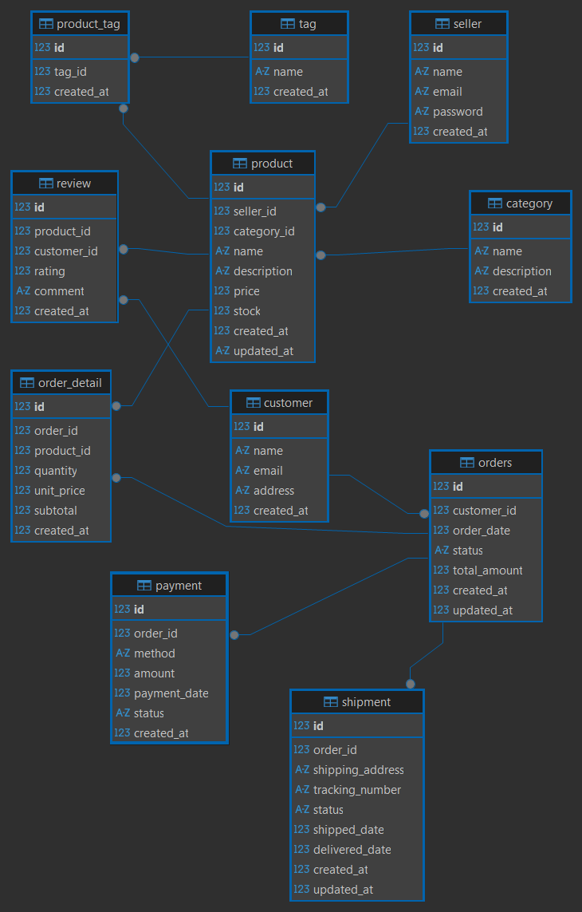
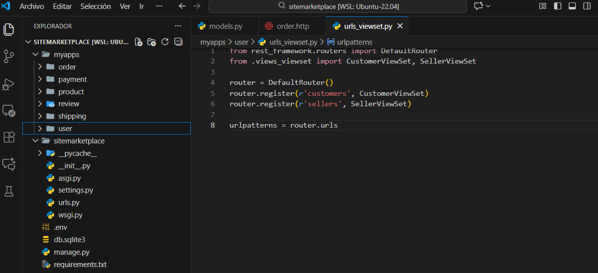

# 📘 SYSTEM DOCUMENTATION  
## MARKETPLACE SYSTEM

## 1. Project Information

| Field | Value |
|-------|--------|
| **Project Name** | Marketplace System |
| **Student Name** | Loreley González Iguarán |
| **Course** | Ingeniería de Sistemas |
| **Semester** | 7 |
| **Date** | 2025 |
| **Instructor** | Jaider Quintero |

### Short Project Description  
The database is designed for an e-commerce marketplace system that manages products, sellers, customers, orders, payments, shipments, and reviews. The design follows a normalized relational model with clear relationships between entities.

### Entity Relationship Diagram



### Logical Model
# Main Entities:
Seller: Manages vendor/seller information

Customer: Stores buyer data for the marketplace

Product: Contains items available for sale

Category: Organizes products into thematic categories

Order: Records purchase transactions

Payment: Handles financial transaction information

Shipment: Manages product delivery process

Review: Stores customer opinions and ratings

Tag: Tag system for flexible product categorization

## Relationships and Constraints
# Main Relationships
Seller → Product: One to Many (one seller has many products)

Category → Product: One to Many (one category has many products)

Customer → Order: One to Many (one customer has many orders)

Order → OrderDetail: One to Many (one order has many details)

Product → OrderDetail: One to Many (one product appears in many details)

Product → Review: One to Many (one product has many reviews)

Customer → Review: One to Many (one customer makes many reviews)

Product ↔ Tag: Many to Many (through product_tag)

# Integrity Constraints
Unique keys on seller and customer emails

CHECK constraints on rating (1-5)

Default values on date fields

NOT NULL constraints on mandatory fields

Appropriate cascade deletion configuration

### 📘SITE MARKETPLACE
# Backend Documentation

The backend is built using Django with Django REST Framework following a modular application structure. The architecture supports:

Multi-database engine support (MySQL, PostgreSQL, MSSQL, Oracle)

RESTful API design with ViewSets

Modular app structure for scalability

CORS enabled for frontend integration

Environment-based configuration



# Core Configuratio

# Database Configuration (Multi-engine support)
## Step-by-Step Explanation:
sitemarketplace/ - Root directory containing the entire project

sitemarketplace/settings.py - Central configuration file for database, apps, middleware

myapps/ - Modular approach: each feature in its own app for better organization

manage.py - Used to run commands like runserver, migrate, createsuperuser

### Explanation of Key Settings:

SECRET_KEY: Used for cryptographic signing - keep this secret!

DEBUG: When True, shows detailed error pages. Set to False in production.

INSTALLED_APPS: Every Django app must be registered here to work.

DATABASES: Configures database connection. We support multiple databases.

CORS: Allows frontend applications to communicate with the backend.
#### Settings.py Database Configuration:
```python
# Database Engine Selection
# Options: mysql, postgresql, mssql, oracle
DATABASE_ENGINE=mysql

# MySQL Configuration
MYSQL_NAME=marketplace_2025_django
MYSQL_USER=root
MYSQL_PASSWORD=1234
MYSQL_HOST=127.0.0.1
MYSQL_PORT=3307

# PostgreSQL Configuration
POSTGRES_NAME=marketplace_2025_django
POSTGRES_USER=postgres
POSTGRES_PASSWORD=1234
POSTGRES_HOST=127.0.0.1
POSTGRES_PORT=5433

# MS SQL Server Configuration
MSSQL_NAME=marketplace_2025_django
MSSQL_USER=sa
MSSQL_PASSWORD=Admin1234#
MSSQL_HOST=127.0.0.1
MSSQL_PORT=1434

# Oracle Configuration
ORACLE_NAME=marketplacedb_admin_django
ORACLE_USER=marketplacedb_admin_django
ORACLE_PASSWORD=Oracle123
ORACLE_HOST=127.0.0.1
ORACLE_PORT=1521
ORACLE_SID=XE


# MS SQL
# python -m pip install mssql-django pyodbc
# POSTGRES
# python -m pip install psycopg2-binary
# MYSQL
# python -m pip install mysqlclient
# ORACLE
# python -m pip install cx_Oracle
```
### user Models
```python
class Customer(models.Model):
    STATUS_CHOICES = [
        ('ACTIVE', 'Active'),
        ('INACTIVE', 'Inactive'),
    ]

    name = models.CharField(max_length=100)
    email = models.EmailField(max_length=100, unique=True)
    phone = models.CharField(max_length=12)
    address = models.CharField(max_length=150)
    status = models.CharField(max_length=8, choices=STATUS_CHOICES, default='ACTIVE')
    created_at = models.DateTimeField(auto_now_add=True)

    def __str__(self):
        return f"{self.name} {self.last_name}"
```

#### Customer :
```javascript
GET /api/customers/ - List all customers
```
```javascript
POST /api/customers/ - Create new customer
```
```javascript
PUT /api/customers/{id}/ - Update customer
```
```javascript
DELETE /api/customers/{id}/ - Delete customer
```

### Example API Request:
```javascript
{
  "name": "John Doe",
  "email": "john@example.com",
  "phone": "1234567890",
  "address": "123 Main St",
  "status": "ACTIVE"
}
```

### Key Points Explained:
models.Model: Base class for all Django models

Field types: CharField, EmailField, DateTimeField define data types

max_length: Maximum characters allowed for the field

unique=True: Ensures no duplicate values in the database

choices: Restricts field to predefined values

auto_now_add=True: Automatically sets timestamp when object is created

help_text: Provides guidance in admin interface

Serializers (serializers.py) - Data Conversion:

### serializers.ModelSerializer: Automatically creates serializers based on models

fields = 'all': Includes all model fields in the API

read_only_fields: Fields that are automatically set and cannot be modified

Custom validation: Additional rules for data integrity


## Angular Frontend Development
# Component Generation
# 1. Generate CRUD Components
For each module, execute these commands in VS Code terminal:

```javascript
# User - Customer components
ng g c components/user/customer/getall
ng g c components/user/customer/create
ng g c components/user/customer/update
ng g c components/user/customer/delete

# User - Seller components
ng g c components/user/seller/getall
ng g c components/user/seller/create
ng g c components/user/seller/update
ng g c components/user/seller/delete

# Product components
ng g c components/product/getall
ng g c components/product/create
ng g c components/product/update
ng g c components/product/delete

# Repeat for order, payment, shipping, review modules...
```
# Creates the four basic CRUD operations (Create, Read, Update, Delete) as separate components for better maintainability and separation of concerns.

## 2. Verify Component Creation
Check that each component folder contains:
```javascript
component.ts (TypeScript logic)
```
```javascript
component.html (Template)
```
```javascript
component.css (Styles)
```
```javascript
component.spec.ts (Tests)
```
```javascript
## Routing Configuration
# File: src/app/app.routes.ts
```

```javascript
Implementation Steps:
Import All Components
```
```python
import { Routes } from '@angular/router';

// User - Customer Components
import { Getall as CustomerGetall } from './components/user/customer/getall/getall';
import { Create as CustomerCreate } from './components/user/customer/create/create';
import { Update as CustomerUpdate } from './components/user/customer/update/update';
import { Delete as CustomerDelete } from './components/user/customer/delete/delete';

// User - Seller Components
import { Getall as SellerGetall } from './components/user/seller/getall/getall';
import { Create as SellerCreate } from './components/user/seller/create/create';
import { Update as SellerUpdate } from './components/user/seller/update/update';
import { Delete as SellerDelete } from './components/user/seller/delete/delete';

// Import other modules similarly...
```
# Define Routes Array

```python
export const routes: Routes = [
  // Default route
  { path: '', redirectTo: '/dashboard', pathMatch: 'full' },
  
  // Customer routes
  { path: "customers", component: CustomerGetall },
  { path: "customers/new", component: CustomerCreate },
  { path: "customers/edit/:id", component: CustomerUpdate },
  { path: "customers/delete/:id", component: CustomerDelete },
  
  // Seller routes
  { path: "sellers", component: SellerGetall },
  { path: "sellers/new", component: SellerCreate },
  { path: "sellers/edit/:id", component: SellerUpdate },
  { path: "sellers/delete/:id", component: SellerDelete },
  
  // Continue with product, order, payment, shipping, review routes...
];

```
Important: Use aliases (as ComponentName) to avoid naming conflicts between modules.
# Model Definition
## Purpose
Models define the data structure for each entity, ensuring type safety and consistency throughout the application.

# Create one model file per entity in src/app/models/
 Customer Model

 ```javascript
     src/app/models/user/customer.ts
 ```

 ```javascript
export interface Customer {
  id?: number;
  user_id?: number;
  first_name: string;
  last_name: string;
  email: string;
  phone: string;
  address: string;
  date_of_birth?: string;
  status: "ACTIVE" | "INACTIVE";
  created_at?: string;
  updated_at?: string;
}

export interface CustomerResponse {
  id?: number;
  full_name: string;
  email: string;
  phone: string;
  address: string;
  status: string;
}
 ```
 ```javascript
Product Model 
  ```
   ```javascript
   export interface Product {
  id?: number;
  name: string;
  description: string;
  price: number;
  stock_quantity: number;
  seller_id: number;
  category?: string;
  images?: string[];
  status: "ACTIVE" | "INACTIVE";
  created_at?: string;
  updated_at?: string;
}

export interface ProductResponse {
  id?: number;
  name: string;
  description: string;
  price: number;
  stock_quantity: number;
  seller_name: string;
  category: string;
  status: string;
} 

``` 
# Model Guidelines
``` 
 Use interface for type definitions

``` 
``` 
Include both input (Create/Update) and response
``` 
``` 
Mark optional fields with ?
``` 
``` 
Use union types for status fields ("ACTIVE" | "INACTIVE")
``` 

# Service Implementation

# Purpose
Services handle HTTP communication with the backend API and manage application state.

# File Structure
Create one service file per entity in 
```javascript
src/app/services/
```
# Customer Service
```javascript
src/app/services/user/customer.service.ts
```
```javascript
import { Injectable } from '@angular/core';
import { HttpClient } from '@angular/common/http';
import { Observable, BehaviorSubject } from 'rxjs';
import { map, tap, catchError } from 'rxjs/operators';
import { Customer, CustomerResponse } from '../../models/user/customer';

interface PaginatedResponse<T> {
  count: number;
  next: string | null;
  previous: string | null;
  results: T[];
}

@Injectable({
  providedIn: 'root'
})
export class CustomerService {
  private baseUrl = 'http://localhost:8000/api/customers';
  private customersSubject = new BehaviorSubject<CustomerResponse[]>([]);
  public customers$ = this.customersSubject.asObservable();

  constructor(private http: HttpClient) {}

  // Get all customers
  getAllCustomers(): Observable<CustomerResponse[]> {
    return this.http.get<PaginatedResponse<CustomerResponse>>(`${this.baseUrl}/`)
      .pipe(
        map(response => response.results),
        tap(customers => this.customersSubject.next(customers))
      );
  }

  // Get customer by ID
  getCustomerById(id: number): Observable<CustomerResponse> {
    return this.http.get<CustomerResponse>(`${this.baseUrl}/${id}/`);
  }

  // Create new customer
  createCustomer(customer: Customer): Observable<CustomerResponse> {
    return this.http.post<CustomerResponse>(`${this.baseUrl}/`, customer)
      .pipe(tap(() => this.refreshCustomers()));
  }

  // Update customer
  updateCustomer(id: number, customer: Partial<Customer>): Observable<CustomerResponse> {
    return this.http.put<CustomerResponse>(`${this.baseUrl}/${id}/`, customer)
      .pipe(tap(() => this.refreshCustomers()));
  }

  // Delete customer
  deleteCustomer(id: number): Observable<void> {
    return this.http.delete<void>(`${this.baseUrl}/${id}/`)
      .pipe(tap(() => this.refreshCustomers()));
  }

  // Refresh customers list
  private refreshCustomers(): void {
    this.getAllCustomers().subscribe();
  }
}
```

# Service Methods Checklist

```
getAllEntities() - List all records
```
```
 getEntityById(id) - Get single record
```

```
createEntity(data) - Create new record
```
```updateEntity(id, data) - Update existing record
```
```
deleteEntity(id) - Delete record

```
```
Proper error handling with catchError
```
```
State management with BehaviorSubject
```

# Menu Configuration

```javascript
src/app/components/layout/aside/aside.component.ts
```
```javascript
import { Component } from '@angular/core';
import { MenuItem } from 'primeng/api';
import { PanelMenu } from 'primeng/panelmenu';

@Component({
  selector: 'app-aside',
  standalone: true,
  imports: [PanelMenu],
  templateUrl: './aside.html',
  styleUrl: './aside.css'
})
export class Aside {
  items: MenuItem[] | undefined;

  ngOnInit() {
    this.items = [
      {
        label: 'Users',
        icon: 'pi pi-fw pi-users',
        items: [
          {
            label: 'Customers',
            icon: 'pi pi-fw pi-user',
            routerLink: '/customers',
          },
          {
            label: 'Sellers',
            icon: 'pi pi-fw pi-user-plus',
            routerLink: '/sellers',
          }
        ]
      },
      {
        label: 'Products',
        icon: 'pi pi-fw pi-shopping-bag',
        routerLink: '/products',
      },
      {
        label: 'Orders',
        icon: 'pi pi-fw pi-shopping-cart',
        routerLink: '/orders',
      },
      {
        label: 'Payments',
        icon: 'pi pi-fw pi-credit-card',
        routerLink: '/payments',
      },
      {
        label: 'Shipping',
        icon: 'pi pi-fw pi-truck',
        routerLink: '/shippings',
      },
      {
        label: 'Reviews',
        icon: 'pi pi-fw pi-star',
        routerLink: '/reviews',
      }
    ];
  }
}
```
# Step-by-Step Module Development

## Phase 1: Setup
##### Generate Components - Create CRUD components for the module
##### Define Models - Create TypeScript interfaces
##### Implement Service - Create service with API methods
## Phase 2: Integration
##### Configure Routes - Add routes to
```javascript
  app.routes.ts
```
#### Update Menu - Add navigation item in aside component
#### Implement Templates - Create HTML templates for each component
## Phase 3: Testing 
#### Test Navigation - Verify all routes work correctly 
#### Test CRUD Operations - Verify create, read, update, delete functionality
#### Validate Forms - Test form validation and error handling
 
 # Application Configuration
 ```javascript
 import { ApplicationConfig } from '@angular/core';
import { provideRouter } from '@angular/router';
import { provideHttpClient, withInterceptorsFromDi } from '@angular/common/http';
import { provideAnimationsAsync } from '@angular/platform-browser/animations/async';
import { providePrimeNG } from 'primeng/config';
import Aura from '@primeuix/themes/aura';
import { routes } from './app.routes';

export const appConfig: ApplicationConfig = {
  providers: [
    provideRouter(routes),
    provideHttpClient(withInterceptorsFromDi()),
    provideAnimationsAsync(),
    providePrimeNG({
      theme: {
        preset: Aura
      }
    })
  ]
};
 ```

 # Required Dependencies
 ```javascript
 npm install primeng primeicons
 ```

# PrimeIcons Configuration
```javascript
src/styles.css
```
# Testing and Verification
#### Start development server
```javascript
ng serve
```

## URL Testing Checklist
```javascript
http://localhost:4200/customers
```
```javascript
http://localhost:4200/sellers
```
```javascript
http://localhost:4200/products
```
```javascript
http://localhost:4200/orders
```
```javascript
http://localhost:4200/payments
```
```javascript
http://localhost:4200/shippings
```

```javascript
http://localhost:4200/reviews
```

## Conclusion


This manual documents the complete implementation of the Angular frontend system, consisting of 6 main modules with full CRUD functionality. The architecture follows development best practices, ensuring:

Scalability: Modular structure allowing easy addition of new modules

Maintainability: Organized code with clear separation of concerns

Consistency: Uniform patterns across all modules

User Experience: Intuitive interface with PrimeNG components

#### This manual will serve as permanent reference for development, maintenance, and scaling of the frontend system, ensuring consistency and quality in future implementations.


